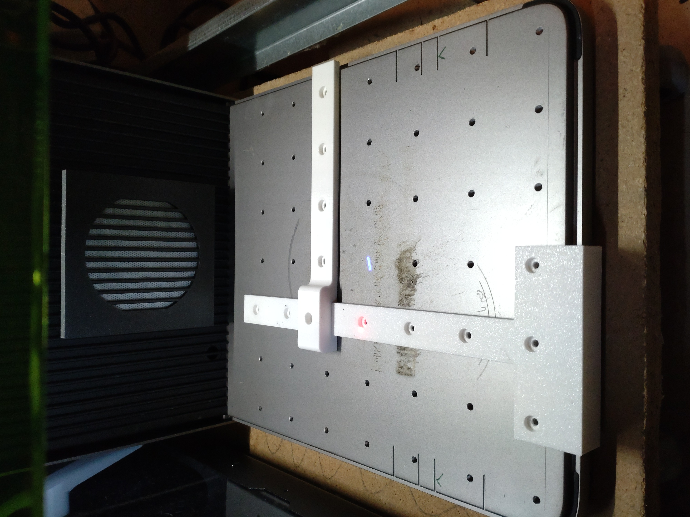
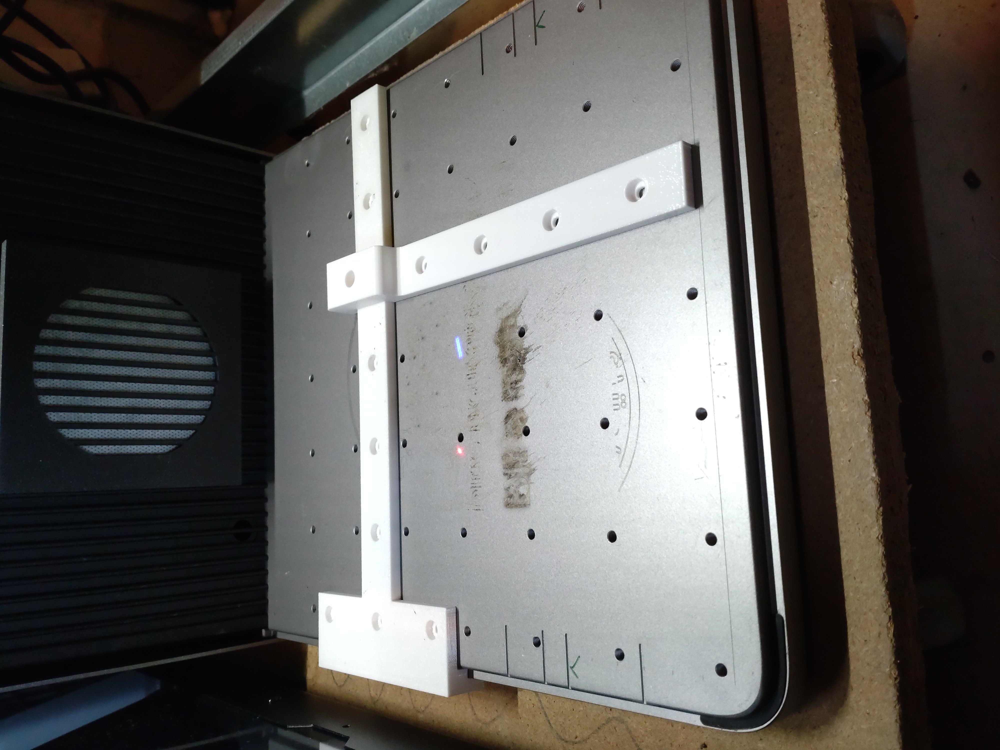
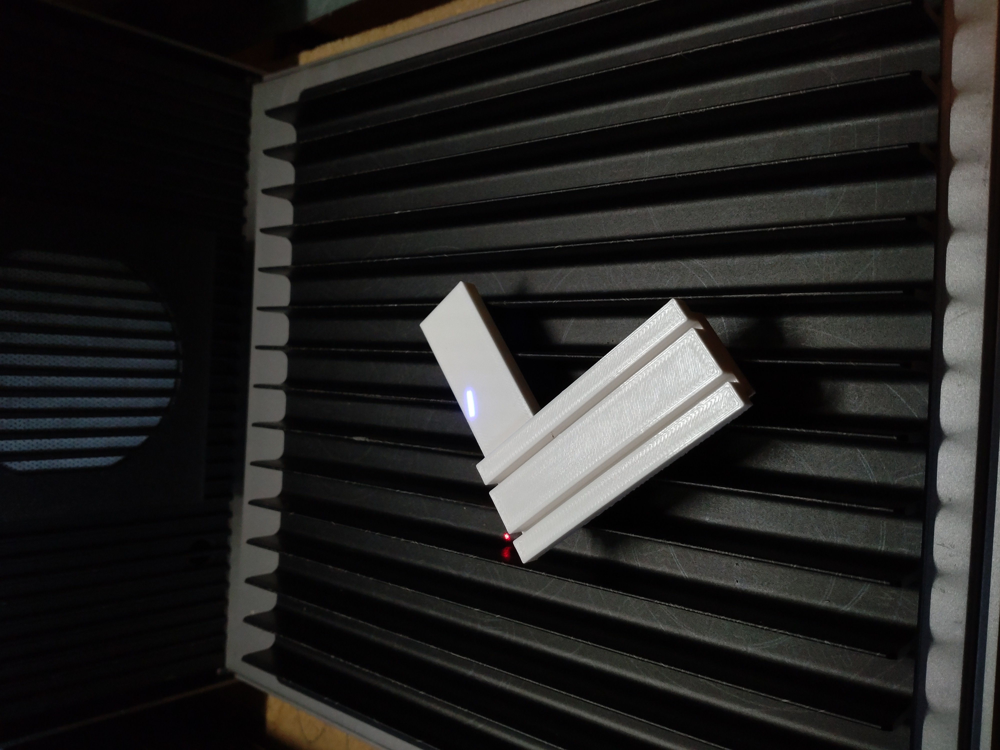
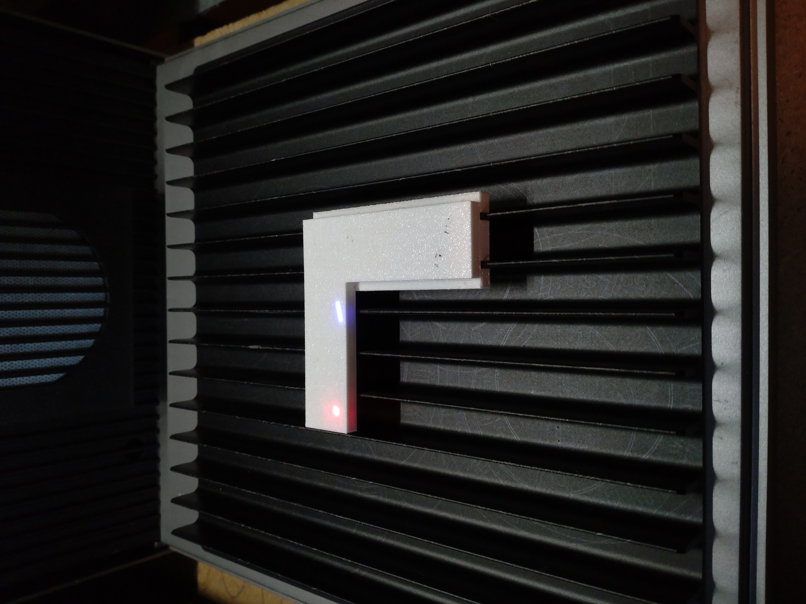
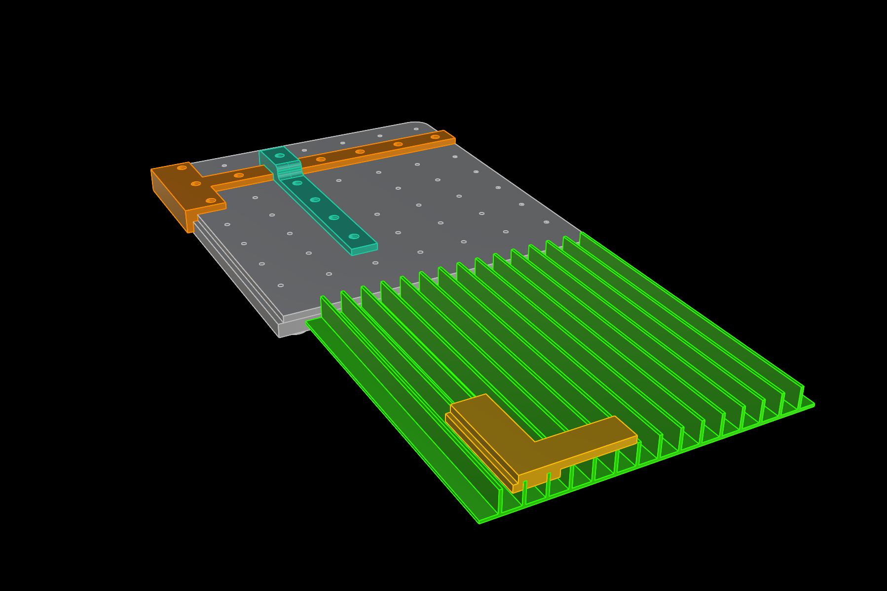
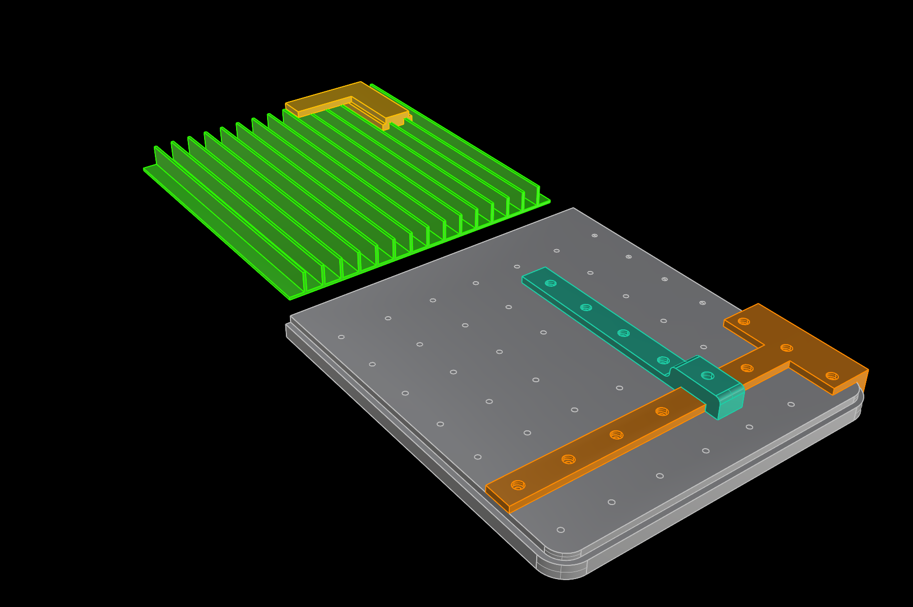

# xTool-F1-Ultra-Angles
Some 3D printable Angles for the xTool F1 Ultra Laser. Created with Rhino 8.

Needed sometimes for placing parts exactly on a specific position. 
One for the base plate and another one for the cutting panel.
You can slide one of them along the base plate side or along the cutting panel.

Requirements:
* 3D printer 
* PETG Filament of your choice

## View

 

  

